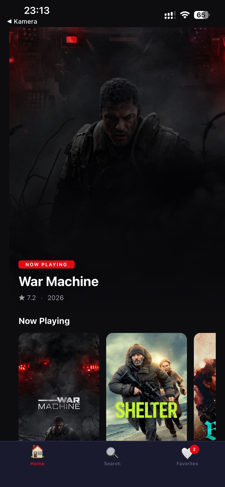
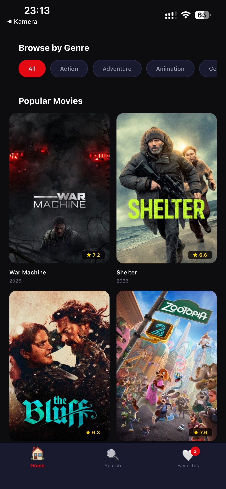
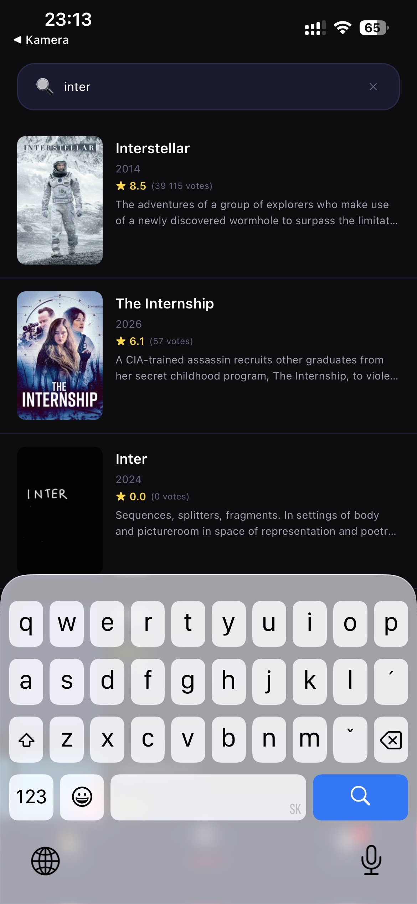
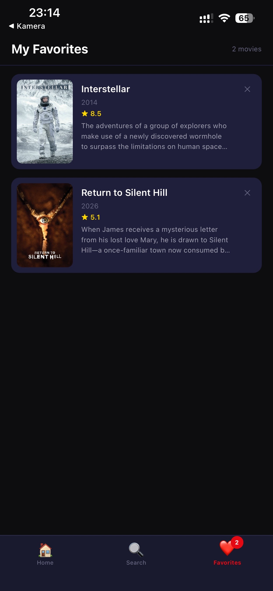

# 🎬 Movie Browser

A production-quality React Native movie discovery app powered by the [TMDB API](https://www.themoviedb.org/).


## 📱 Screenshots

| Home | Now Playing | Search | Favorites |
|------|-------------|--------|-----------|
|  |  |  |  |

---

## ✨ Features

- **Home** — Hero banner (Now Playing) + infinite-scroll Popular grid with genre filter chips
- **Search** — Debounced (300ms) full-text movie search with poster, year, and rating
- **Detail** — Hero backdrop with parallax scroll, cast carousel, similar movies, and share button
- **Favorites** — Persisted locally with AsyncStorage; animated add/remove
- **Skeleton loaders** — Shimmer placeholders on all screens while data loads
- **Image placeholders** — `expo-image` blur-hash while posters load
- **Animations** — All built with React Native Reanimated v4 (no Animated API)

---

## 🏗️ Tech Stack

| Layer | Library |
|---|---|
| Framework | Expo SDK 54, React Native 0.81 |
| Language | TypeScript (strict) |
| Navigation | React Navigation v6 (Stack + Bottom Tabs) |
| Animations | React Native Reanimated v4 |
| State | Zustand + AsyncStorage persist |
| HTTP | Axios with interceptors |
| Images | expo-image |
| Testing | Jest + React Native Testing Library |
| Linting | ESLint + Prettier |
| CI | GitHub Actions |

---

## 🚀 Getting Started

### 1. Get a free TMDB API key

1. Create a free account at [themoviedb.org](https://www.themoviedb.org/signup)
2. Go to **Settings → API** and request a Developer key
3. Copy your **Read Access Token** (long JWT starting with `eyJ`)

### 2. Configure your environment

```bash
cp .env.example .env
# Open .env and replace `your_key_here` with your Read Access Token
```

> **Note:** Use the **Read Access Token** (JWT), not the short v3 API key. The app uses Bearer token authentication.

### 3. Install dependencies

```bash
npm install --legacy-peer-deps
```

### 4. Start the app

```bash
# Expo Go (scan QR with your phone)
npm start

# Android emulator
npm run android

# iOS simulator (macOS only)
npm run ios

# Web browser
npm run web
```

---

## 📁 Project Structure

```
src/
├── api/          → Axios instance + all typed TMDB API functions
├── components/   → Reusable UI components (MovieCard, Skeleton, etc.)
├── constants/    → theme.ts (colors, spacing, typography) + api.ts
├── hooks/        → Custom hooks (useMovies, useSearch, useFavorites, …)
├── navigation/   → RootNavigator (Stack) + TabNavigator (Bottom Tabs)
├── screens/      → HomeScreen, SearchScreen, DetailScreen, FavoritesScreen
├── store/        → Zustand favorites store with AsyncStorage persist
├── types/        → TypeScript interfaces (Movie, Cast, Genre, Navigation)
└── utils/        → imageUtils, dateUtils, ratingUtils
```

---

## 🧪 Running Tests

```bash
# Run all tests with coverage
npm test

# CI mode (fail on coverage threshold)
npm run test:ci

# Type-check only
npm run typecheck

# Lint only
npm run lint
```

Coverage targets: **80%+** on hooks, utils, and store.

---

## 🛡️ Security

- The TMDB API key is **never hardcoded** — always read from `process.env.EXPO_PUBLIC_TMDB_API_KEY`
- The CI pipeline explicitly checks for hardcoded keys on every push
- `.env` is in `.gitignore`; only `.env.example` is committed

---

## 📄 License

MIT
